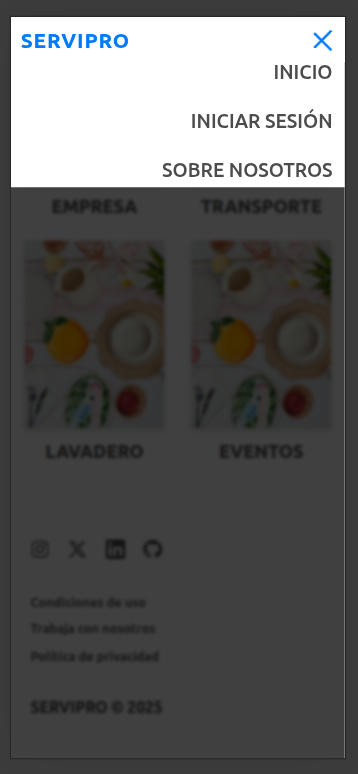
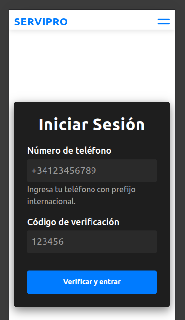

## MVP APP SERVICIOS

  
  

---

## Sobre este proyecto

- Frontend diseñado para consumir y visualizar los servicios gestionados por [App-Servicios-Backend](https://github.com/JoanSimonutti/App-Servicios-Backend)
- Permite a los usuarios:
  - Buscar y filtrar prestadores por categoría y localidad.
  - Ver detalles ampliados de cada servicio.
  - Contactar a los prestadores mediante teléfono o WhatsApp.
  - Registrar las interacciones para analítica.
  - Consultar métricas administrativas sobre la cantidad de contactos realizados.

### Tecnologías utilizadas

- **React.js**: Librería principal para construir la interfaz de usuario.
- **Vite**: Herramienta de build ultra-rápida para proyectos modernos en React.
- **Bootstrap**: Framework CSS utilizado para estilos rápidos y responsivos.
- **Axios**: Cliente HTTP para conectar con el backend.
- **React Router Dom**: Para navegación SPA entre distintas vistas.
- **dotenv**: Manejo de variables de entorno sensibles sin exponerlas en el código.
- **Vercel**: Hosting de frontend para el deploy en producción.

## Funcionalidades implementadas

### Home

- Muestra listado de todos los prestadores.
- Filtros dinámicos por:
  - Categoría.
  - Localidad.

### Detalle de servicio

- Vista individual de cada prestador.
- Muestra:
  - Nombre.
  - Categoría.
  - Tipo de servicio.
  - Horarios de atención.
  - Localidades cercanas.
  - Disponibilidad 24hs.
- Botones para:
  - Llamar por teléfono.
  - Enviar mensaje por WhatsApp.
- Cada clic se registra en el backend.

### Panel administrativo

- Consulta estadísticas de contactos:
  - Clics en WhatsApp.
  - Clics en Teléfono.
  - Total de interacciones por prestador.

---

Creado por [Joan Simonutti](https://www.linkedin.com/in/joansimonutti/) | 2025

